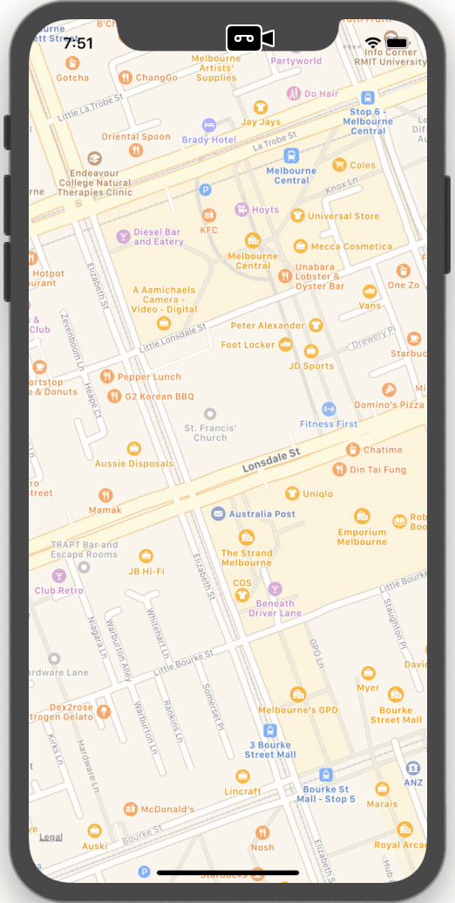

## Caution
ObjectAnimator is an experimental library written in Swift. The library starts as a direct port of Android's anmations.ObjectAnimator. Along with the development, generics are introduced to avoid duplicate logic as in Android's ObjectAnimator. It can be used as a start point to develop full-blown ObjectAnimator to coordinate animation on custom object. Contributions are highly welcome.

# Examples
Long press on the map to set start point and end point. Route will be drawn with animations.




# ObjectAnimator

## Todo (Essential)

* Resume/Pause
* ~~Repeat~~
* Reverse
* Start delay
* Jank before first frame?
* Interpolator

## Todo

* AnimatorSet
* Input verification e.g. duration >= 0

## Usage
```Swift
import ObjectAnimator
```

#### Initialize with a TypeEvaluator (provided by the library or custom ones)
```swift
let animator = ObjectAnimator(values: coordinates, evaluator: LatLngEvaluator())
```

#### Set duration (default is 300ms) and start
```swift    
animator.duration = 3
animator.start
```
_Checkout MapRouteViewController for more detailed usages._


## License

ObjectAnimator is available under the MIT license. See the LICENSE file for more info.
